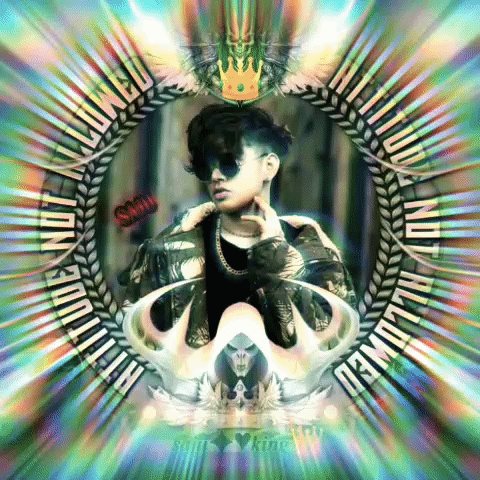

<div align="center">
  
  <h1>☠️ SAJU // DARKNET_MATRIX ☠️</h1>
</div>

```text
 ██████╗░██████╗░███╗░░██╗███████╗████████╗
 ██╔══██╗██╔══██╗████╗░██║██╔════╝╚══██╔══╝
 ██║░░██║██████╔╝██╔██╗██║█████╗░░░░░██║░░░
 ██║░░██║██╔══██╗██║╚████║██╔══╝░░░░░██║░░░
 ██████╔╝██║░░██║██║░╚███║███████╗░░░██║░░░
 ╚═════╝░╚═╝░░╚═╝╚═╝░░╚══╝╚══════╝░░░╚═╝░

🚀 Features * 💻 **Interactive Hacker Terminal:

** Real-time command line interface aesthetics. * 🌈 **RGB Dance & Neon Strobe:** Dynamic lighting effects tailored for a darknet-inspired experience. * 🎵
 **Integrated Audio Player:** Custom embedded background sound and visualizer setup. * 📱
**Fully Responsive UI:*
* Optimized layout across desktop, tablet, and mobile devices. * 🛡️ **Cyberpunk UI Design:
** Glassmorphism effects, glowing neon borders, and custom CSS animations. --- ## 🛠️ Tech Stack * **Markup & Structure:** HTML5 *
 **Styling & FX:** CSS3 (Animations, Glassmorphism, Keyframes) * **Scripting & Logic:** JavaScript (ES6+) * **Assets:** Custom Images & Audio Files ---
 ## 📁 Project Structure ```text ├── index.html # Main portal structure ├── my-pic.jpg # Personal profile picture ├── song.mp3 # Background music ├── README.md # Documentation └── ... # System files
